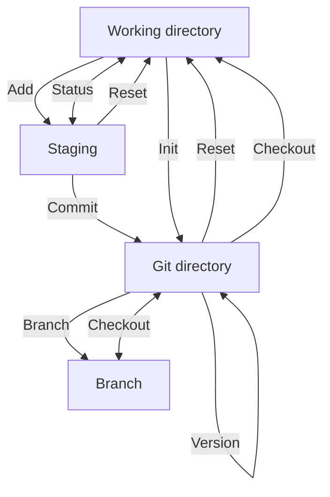

# Personal wiki

## Table of contents

### [Tools](#tools)

- [Code editor](#code-editor)
- [Browser](#browser)
- [JavaScript runtime](#javascript-runtime)
- [Source control management](#source-control-management)

### [SSH as authentication on Github](#ssh-as-authentication-on-github-1)

- [Generate a SSH key](#generate-a-ssh-key)
- [Adding SSH key to the ssh-agent](#adding-ssh-key-to-the-ssh-agent)
- [Adding public key to Github](#adding-public-key-to-github)

### [Git commands](#git-commands-1)

- [Local Git commands](#local-git-commands)

  - [git version](#git-version)
  - [git config](#git-config)
  - [git init](#git-init)
  - [git status](#git-status)
  - [git branch](#git-branch)
  - [git add](#git-add)
  - [git commit](#git-commit)
  - [git log](#git-log)
  - [git checkout](#git-checkout)
  - [git reset](#git-reset)

- [Remote Git commands](#remote-git-commands)
  - [git clone](#git-clone)
  - [git remote](#git-remote)
  - [git pull](#git-pull)
  - [git push](#git-push)
  - [git merge](#git-merge)

### [How git works](#how-git-works-1)

### [FAQ](#faq-1)

- [What is Github?](#what-is-github)
- [Why do I need Github?](#why-do-i-need-github)
- [Common issues when collaborating using Git](#common-issues-when-collaborating-using-git)

---

## Tools

### **Code editor**

[![VSCode][vscode]][vscode-url]  
Visual studio code is my choice of code editor.  
It is a good code editor with a lot of extensions that help the process of coding and I am also used to i since it is what I have always used to code.

**Extensions:**

- Vue VSCode Snippets

- Vue Language Features (Volar)

- Prettier - Code formatter

- Tailwind CSS IntelliSense

[Top of the page](#)

---

### **Browser**

[![Edge][edge]][edge-url]  
Microsoft Edge is my browser of choice.  
It comes already downloaded with any Windows device which is the OS I am using.

[Top of the page](#)

---

### **JavaScript runtime**

[![Node][node.js]][node-url]  
Node.js

**Installation process**

Automatically install necessary tools.

[Top of the page](#)

---

### **Source control management**

[![Git][git]][git-url]  
Git is the source control management I use.  
I use Git to track the modifications I make to the code by publishing it to a repository on Github. Git makes it so that I can easily work with others and share code to a shared directory. When installing Git it adds useful dependencies such as npm, node.js and chocolately.

**Installation process**

When installing mark the "check for daily updates" box

Choose Visual Studio Code as Git's default editor

Override the default branch name for new repositories to "main"

Use Windows' default console window as terminal emulator.

[Top of the page](#)

---

### **SSH as authentication on Github**

### **Generate a SSH key**

Open Git Bash

You generate a keypair using this line: `$ ssh-keygen -t ed25519 -C your_email@example.com`

Enter a filename or press "Enter" to accept default file location.  
At the prompt about you can either leave it empty for no passphrase or write a secure one for yourself. A passphrase is used as an extra layer of security if someone gains access to every system that uses that SSH key.

### **Adding SSH key to the ssh-agent**

Start it by using the line: `$ eval $(ssh-agent -s)`

Then, add the private ssh key to the ssh-agent using the file location: `$ ssh-add ~/filename`

### **Adding public key to Github**

Copy the contents of your SSH public key.

Then login to your Github account in the browser. Then, in the top right corner, press your profile button and then settings.

In the sidebar on the left, press "SSH and GPG keys".

Click "New SSH key" and in the title field write a descriptive label for the key.

Choose either "Authentication key" or "Signing key". For this, chose "Authentication key" or read more about signing commits [here](https://docs.github.com/en/authentication/managing-commit-signature-verification/about-commit-signature-verification).

Paste the contents of your SSH public key into the "Key" field and press the "Add SSH key" button.

You have now created a SSH key to use as authentication when connecting with Github.

[Top of the page](#)

---

## **Git commands**

---

### **Local Git commands**

### **git version**

[Official documentation](https://git-scm.com/docs/git-version)

Use this to check what version of Git you have installed on your device. When used, it will look something like this:

```
git version
git version 2.39.0.windows.2
```

[Top of the page](#)

---

### **git config**

[Official documentation](https://git-scm.com/docs/git-config)

There are many settings and configurations that you are able to do with Git. You use git config to assign these settings. Two of the most important ones are _user.name_ and _user.email_. These assign what name and email address the commits will be from. When using _--global_ it will write the setting to all the repositories on a computer. So if you want to use the same name and email in every repository you will write:

```
git config --global user.name "Clark Davis"
git config --global user.email "clark.davis@domain.com"
```

Only writing git config will show a list of all the options that are available to use with it.

[Top of the page](#)

---

### **git init**

[Official documentation](https://git-scm.com/docs/git-init)

This initializes a empty Git repository in a certain folder. Use this when setting up a new project. When first used it will look something like this:

```
git init
Initialized empty Git repository in C:/code/testGit/.git/
```

If you use this command again, it will reinitialize the existing Git repository.

Most git commands need you to initialize a repository first, otherwise you will get this error:

```
fatal: not a git repository (or any of the parent directories): .git
```

[Top of the page](#)

---

### **git status**

[Official documentation](https://git-scm.com/docs/git-status)

When you use this command it returns the current state of the git repository. It will return the current working branch and show files that are in the staging area, but not committed yet. But, if there are no changes it will return that there is nothing to commit:

```
git status
On branch main

No commits yet

nothing to commit (create/copy files and use "git add" to track)
```

If you have changes that are not added to the staging area it will look something like this:

```
git status
On branch main
Your branch is up to date with 'origin/main'.

Changes not staged for commit:
  (use "git add <file>..." to update what will be committed)
  (use "git restore <file>..." to discard changes in working directory)
        modified:   filename.js

no changes added to commit (use "git add" and/or "git commit -a")
```

But, if you have staged changes it will look something like this:

```
On branch main
Your branch is up to date with 'origin/main'.

Changes to be committed:
  (use "git restore --staged <file>..." to unstage)
        modified:   filename.js
```

[Top of the page](#)

---

### **git branch**

[Official documentation](https://git-scm.com/docs/git-branch)

With this you can add a branch, view the existing branches or delete a branch.

Create new branch:

```
git branch <branch_name>
```

List all remote or local branches:

```
git branch -a
```

Delete a branch:

```
git branch -d <branch_name>
```

[Top of the page](#)

---

### **git add**

[Official documentation](https://git-scm.com/docs/git-add)

This moves your changes from the working directory to the staging area. Either choosing one file, a whole directory or all files. This needs to be done before you are able to commit to a repository.

General use of _git add_:

```
git add <file or directory name>
```

There are two ways to add all files not staged:

```
git add .
git add -A
```

Stage a specific file:

```
git add index.html
```

Stage an entire directory:

```
git add components
```

[Top of the page](#)

---

### **git commit**

[Official documentation](https://git-scm.com/docs/git-commit)

When you use this command it saves your changes to your local Git repository. This allows you to revert back to any of these points where you made a commit. With each commit, it is best to include a message that explains the changes that have been made. This helps to find a particular commit or easily understand the changes.

Use _git commit_ like this:

```
git commit -m "Commit message in quotes"
[main ce92997] Commit message in quotes
 1 file changed, 10 insertions(+), 0 deletions(-)
 create mode 100644 index.html
```

[Top of the page](#)

---

### **git log**

[Official documentation](https://git-scm.com/docs/git-log)

This command shows a log of all the commits. Git log shows the commit hash which is the long string of numbers and letters, the author name, the date and the message. If you have many commits you can press the up and down arrow key to scroll between them. And if you press "q" you can start writing in the command line again.

```
git log

commit 5681efd9a09f4259dbfcf9a4352d4fe69166b379
Author: Clark Davis <clark.davis@domain.com>
Date:   Mon Jan 16 12:30:00 2023 +0100

    Second commit message

commit cb0f2b499f51c2292c2f899fc1a3c5f441cd71cd
Author: Clark Davis <clark.davis@domain.com>
Date:   Mon Jan 16 12:00:00 2023 +0100

    Commit message in quotes
```

If you use the command _--oneline_ it will show each commit on one line and shorter:

```
git log --oneline
5681efd Second commit message
cb0f2b4 Commit message in quotes
```

[Top of the page](#)

---

### **git checkout**

[Official documentation](https://git-scm.com/docs/git-checkout)

Is used to navigate existing branches and can also restore working tree files.

Checkout an existing branch:

```
git checkout <branch_name>
Switched to branch 'branch_name'
```

Checkout and create a new branch with that name:

```
git checkout -b <new_branch>
Switched to a new branch 'new_branch'
```

[Top of the page](#)

---

### **git reset**

[Official documentation](https://git-scm.com/docs/git-reset)

This is used to move a repository back to a previous commit, which discards any changes made after that commit. To use _git reset_ you need the seven first letters or numbers from the commit hash. When you know that you can reset to a previous version:

```
git log --oneline
5681efd Second commit message
cb0f2b4 Commit message in quotes

git reset cb0f2b4

git log --oneline
cb0f2b4 Commit message in quotes
```

You can undo the reset by doing another reset with the commit hash from the newer version. Although the newer commit is not showing up in the log, it is not removed from Git.

```
git log --oneline
cb0f2b4 Commit message in quotes

git reset 5681efd

git log -oneline
5681efd Second commit message
cb0f2b4 Commit message in quotes
```

Git reset can also unstage changes that you have made:

```
git status
On branch main
Your branch is up to date with 'origin/main'.

Changes not staged for commit:
  (use "git add <file>..." to update what will be committed)
  (use "git restore <file>..." to discard changes in working directory)
        modified:   filename.js

no changes added to commit (use "git add" and/or "git commit -a")

git add .

git status
On branch main
Your branch is up to date with 'origin/main'.

Changes to be committed:
  (use "git restore --staged <file>..." to unstage)
        modified:   filename.js

git reset
Unstaged changes after reset:
M       filename.js

git status
On branch main
Your branch is up to date with 'origin/main'.

Changes not staged for commit:
  (use "git add <file>..." to update what will be committed)
  (use "git restore <file>..." to discard changes in working directory)
        modified:   filename.js

no changes added to commit (use "git add" and/or "git commit -a")
```

[Top of the page](#)

---

### **Remote Git commands**

### **git clone**

[Official documentation](https://git-scm.com/docs/git-clone)

This allows you to get a copy of an existing Git repository. With this you can make contributions or just look at code other people have made. Cloning will create a directory locally with all the files and repository history.

```
git clone <remote_url>
```

[Top of the page](#)

---

### **git remote**

[Official documentation](https://git-scm.com/docs/git-remote)

This connects your local repository with a remote one. Often the remote repository is named so you avoid having to remember the URL. The remote repository can have any name, but the common practice is to name it 'origin'.

```
git remote <command> <remote_name> <remote_URL>
```

You add a remote repository by typing this:

```
git remote add origin https://github.com/profile/repository.git
```

[Top of the page](#)

---

### **git pull**

[Official documentation](https://git-scm.com/docs/git-pull)

This is used to integrate the latest remote changes in a project to your working branch.

```
git pull <remote_name> <branch_name>
```

[Top of the page](#)

---

### **git push**

[Official documentation](https://git-scm.com/docs/git-push)

This is used to share your local changes in the code and "push" them, often to a Github repository. You need two parameters to push: the remote repository and the branch that the push is for.

```
git push <remote_name> <branch_name>
```

You can also push all the local branches using:

```
git push -all
```

[Top of the page](#)

---

### **git merge**

[Official documentation](https://git-scm.com/docs/git-merge)

This is used to integrate branches together. Merge combines changes from one branch to another branch. You can for example merge changes in a developer branch to the main branch.

This command merges changes from on branch to the current branch:

```
git merge <branch_name>
```

[Top of the page](#)

---

### **How git works**



[Top of the page](#)

---

## **FAQ**

### **What is Github?**

Github is a software development platform online. You can use it to store your projects, track your progress and collaborate on projects with other users. It is very easy to access your code or anyone else's. You can look at what other people have done, download their code, and even contribute to it.

### **Why do I need Github?**

Github is an easy way to store your code and collaborate with others on projects. When someone contributes with a change you can always look at what they have changed and simply pull the code so you have the latest changes locally.

### **Common issues when collaborating using Git**

Merge conflicts can be very annoying, but there are some things you can try and do to avoid them:

Make sure you use "git pull" often to always have the latest changes and avoid unnecessary conflicts.

If you have multiple branches make sure to push your changes to the correct branch.

But, if you happen to get a merge conflict, there are a few ways to handle it:

Maybe you just made a mistake, then you can write "git merge --abort" in the console to abort the merge

A simple way to resolve a conflict is using "checkout". When you know whose version of the file you want to keep you can write one of two lines in the console:
Keep your own file: "git checkout --ours <filename>"
Keep your collaborators file: "git checkout --theirs <filename>"

Another way to fix it is to pull and edit the file. You can do this using Visual Studio Code. VSCode shows you exactly what the conflict is which makes it easy to edit to fix the conflict.

[Top of the page](#)

[vscode]: https://img.shields.io/badge/Visual_Studio_Code-0078D4?style=for-the-badge&logo=visual%20studio%20code&logoColor=white
[vscode-url]: https://code.visualstudio.com/
[git]: https://img.shields.io/badge/GIT-E44C30?style=for-the-badge&logo=git&logoColor=white
[git-url]: https://git-scm.com/
[edge]: https://img.shields.io/badge/Microsoft_Edge-0078D7?style=for-the-badge&logo=Microsoft-edge&logoColor=white
[edge-url]: https://www.microsoft.com/edge
[node.js]: https://img.shields.io/badge/Node.js-43853D?style=for-the-badge&logo=node.js&logoColor=white
[node-url]: https://nodejs.org/
[gitflow]: gitFlow.png
